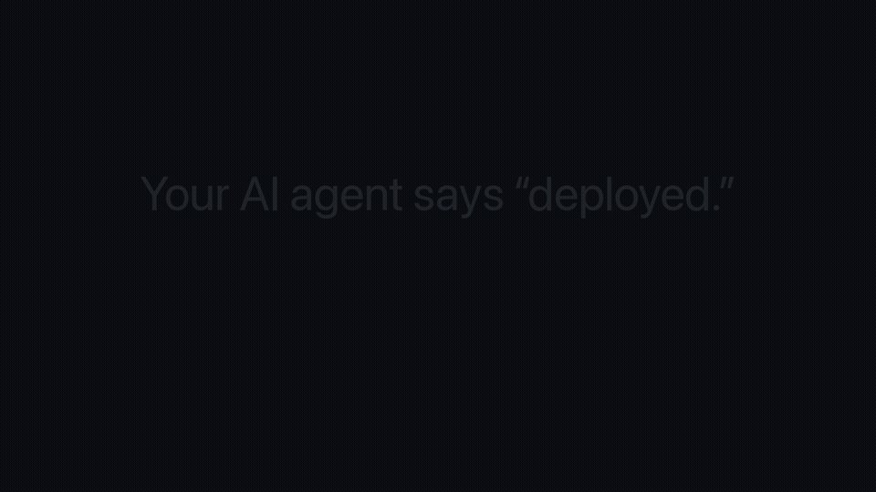

# Kvitansiya — receipts for AI agent claims

Your agent says *"pushed"*, *"deployed"*, *"tests pass"*, *"created `docs/API.md`"*.


Kvitansiya (Uzbek for "receipt") is a Claude Code **Stop hook**. It checks each of those claims against the real world before the agent is allowed to stop. If a claim is false, the stop is blocked and the agent gets the evidence back.

```
KVITANSIYA — 2 claim(s) checked, 1 false
────────────────────────────────────────
✅ push   origin/main = 02b8862 = your commit
❌ deploy HTTP 200, but /version reports 25a3114 — not 02b8862; prod is running an old build
```

That output is from a real, unedited run (Sonnet 5.5, 2026-10-01, see `demo/run/`). After the block, the agent found the bug itself: `deploy.sh` copied a stale `dist/`. It fixed the script, redeployed, and wrote: *"My earlier 'deployed' report was wrong."* The run cost $0.09.

## Install (30 s)

```bash
git clone https://github.com/Dilshod-Abdullayev/kvitansiya && cd kvitansiya
python3 kvitansiya.py install              # dry run: shows what it will add to ./.claude/settings.json
python3 kvitansiya.py install --write      # this project
python3 kvitansiya.py install --user --write   # every project (~/.claude/settings.json)
```

The installer merges with your existing hooks and is idempotent. It also keeps a backup at `settings.json.bak-kvitansiya`. It needs only Python 3.9+ and git, with no API key and no dependencies.

## What it checks

| Claim in the agent's last message | Check against reality |
|---|---|
| "pushed to main", "push qildim" | `git ls-remote`: the remote branch has your commit. If the session's own `git push` output says `[rejected]`, the claim fails. |
| "committed as abc1234" | The commit exists in a repo the session touched. The agent may have `cd`'d elsewhere; that is found from the transcript. |
| "deployed / is live at https://…" | Checks HTTP status and quoted text on the page. For versions it tries `/version`, `/api/version`, `/health` and looks for the commit the agent shipped, even when that hash sits in another sentence or only in the deploy command's repo. |
| "all tests pass", "testlar o'tdi" | Uses the session transcript: a test command must have run **after the last file edit** and succeeded. |
| "created `path/file`" | The file exists and is not empty. The path is resolved through the agent's own Write/Edit calls. |

It understands English and Uzbek. Negations and plans ("I didn't push", "will deploy", "push qilmadim", "kerak") are not treated as claims. Neither are commands inside code fences.

## Principles

- **No accusation without evidence.** Anything it cannot locate becomes `⚠` or is skipped; only a contradiction becomes `❌`. Examples: a relative path from another folder, or a hash from a repo it cannot see. `KVITANSIYA_REPOS=/path/a:/path/b` adds repos to search.
- **Never loops.** It blocks at most once per stop (`stop_hook_active`). The second time it only reports.
- **Honest partial results pass.** "103/106 tests pass, 3 pre-existing" is not blocked.
- Every result is logged to `~/.kvitansiya/log.jsonl`. `python3 kvitansiya.py stats` then gives a summary like "Last 7 days: 41 claims checked, 3 were false".

## Also a CLI

```bash
python3 kvitansiya.py check "Deployed 02b8862, live at https://example.com" --cwd ~/app [--transcript session.jsonl] [--json]
```

## Evidence (how this was tested)

- `python3 -m unittest tests.test_kvitansiya`: 27 tests. They use real git repos with a bare remote, a local HTTP server and fake transcripts. They cover push/commit/deploy/tests/files, clause-scoped negations, report blocks, repo switching via `cd`, a rejected push, honest partial results, the hook protocol and loop protection.
- **Real-corpus false-positive check.** Script: `demo/korpus/korpus.py` (run it on your own `~/.claude/projects`; my output is not published because it quotes private session text). Run on 2026-10-01: The last message of 1 902 real Claude Code sessions on this machine was run through it. 53 contained claims, 49 of them in folders that still exist; 75 receipts came out (8 of them skipped as unlocatable). Result: **0 ❌, 12 ⚠**. All 12 ⚠ are true observations ("pushed, but 5 tracked files still uncommitted", "hash not in any repo I can see"), not accusations. Earlier versions did produce false ❌, and each one became a test: a "git push is forbidden" reminder read as a claim, "nothing pushed", `0.14` taken for a file path, a hash from another repo called invented, a third-party `/health` JSON taken for a version, file lists inside structured report blocks, a fallback URL next to an unrelated "200", and a fragment of `app/(app)/you/index.tsx`. Honest limitation: that historical corpus also contained **no caught lie**. The value was shown on the live sandbox, not on old history.
- **Against the closest existing hook.** [claimcheck](https://github.com/ablanchard-dev/claimcheck) checks claims against the turn's own output. `bash demo/vs-claimcheck.sh` feeds both hooks the same false "deployed", where `deploy.sh` printed `✓ Deployed <sha>` but prod still serves the old build. claimcheck passes it, because the transcript itself says "Deployed". Kvitansiya blocks it, because it asks `/version`.
- `demo/`: `setup.sh` builds the sandbox (a site whose deploy "succeeds" but ships a stale build). `run/` has the three stream-json runs, unedited except that the session-init lines (my local plugin/skill list) were dropped and the home path became `~` (and the local username `user`). `render_demo.py` builds `kvitansiya-demo.mp4` (31 s). It is reconstructed from run 3's transcript text, not a screen recording; the frame says so.
  - Run 1: an earlier version missed the claim, and a test was added.
  - Run 2: the agent hedged ("I didn't load the site"); it is now caught as well.
  - Run 3: blocked, then fixed by the agent.

## Known limits

- Claude Code shows any Stop-hook block as "Stop hook error occurred · ctrl+o to see". That is its label for a block, not a crash; a minimal hook that only blocks shows the same.
- Extraction is regex, not an LLM. It is deterministic and free, but it will miss claims phrased in unusual ways.
- It does not verify DB rows, sent e-mails or Telegram messages yet; that is the next checker set.

## License

MIT
